# O loteamento da DogCity

Estado de 28/08/2026, conferido sobre o terreno real da NASA e não sobre a planta.
Todo número aqui saiu de uma rodada de `scripts/gerar_cidade.py` ou de uma medição
sobre `public/city/cidade-lotes.bin` e `data/dogcity_lotes.csv`. Onde não foi
medido, está escrito NÃO MEDIDO.

**Nada disto está construído.** É demarcação: terra com nome e com dono, para que
o 3D venha depois sem desfazer endereço nenhum.

---

## 1. A cidade em números

| | |
|---|---|
| carteiras com endereço | **52.984 de 52.984** |
| sítio | raio 4.500 m, 63,617 km² |
| borda construída | 4.400 m (os 100 m seguintes são o Cinturão) |
| tecido disponível | 25,42 km² |
| área dos lotes | 20,24 km² |
| **lote mediano** | **312 m²** |
| menor / maior | 33 m² / 28.224 m² (uma superquadra) |
| p99 | 1.963 m² |
| quartos / quarteirões | 226 / 1.182 |
| peças demarcadas | 38, somando 136 ha |

---

## 2. As três regras que produzem isso

**Idade do UTXO diz ONDE.** A ordem é a tupla `(ts, txid, vout)` do UTXO mais
antigo, com zero colisões em 52.991. Endereço é grindável e por isso não desempata;
`txid` e `vout` são escolhidos por quem envia, nunca por quem recebe.

**Saldo diz QUANTO.** Área proporcional à raiz do saldo, com gradiente que faz a
área por DOG crescer com o raio. Proporcional puro daria razão de 648.082x entre o
maior e o menor lote; a raiz dá 805x.

**`utxo_count` diz QUE FORMA.** 1 UTXO (63,2%) é massa única, 2 a 9 (30,6%) é pátio
ou condomínio baixo, 10 a 99 (5,9%) é torre, 100+ (114 carteiras) é quarteirão com
várias torres. Medido: R² de 0,053 contra o saldo, ou seja eixo independente.

---

## 3. O teste sobre o terreno real

A planta 2D desenha sobre um disco perfeito. O mundo tem relevo, cova de parque,
platô e a saia da abóbada. Estas chapas são a conferência na cena, com `?tecido=1`
(o módulo é `app/city/plaza/tecido.ts`).

O módulo tem dois registros, e confundir os dois foi erro de origem: `modo=massa`
(padrão) é o modelo de apresentação, e `modo=demarcacao` é a chapa de diagnóstico,
com plinto raso e cor por coorte, boa para achar lote em máscara e costura torta e
péssima como imagem.

### O plano, de cima

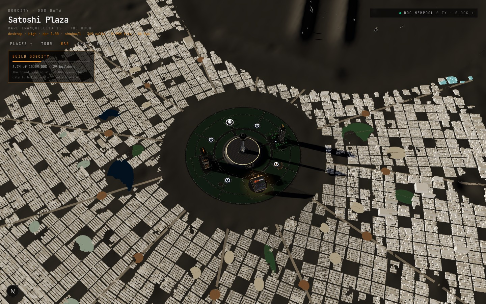

Os doze bulevares de costura saem da praça como artérias, os quarteirões preenchem
entre eles, e as peças demarcadas aparecem em cor: azul escuro os lagos, verde os
jardins, areia o cívico, marrom a cadeia de distribuição.

### O tecido no nível do olho

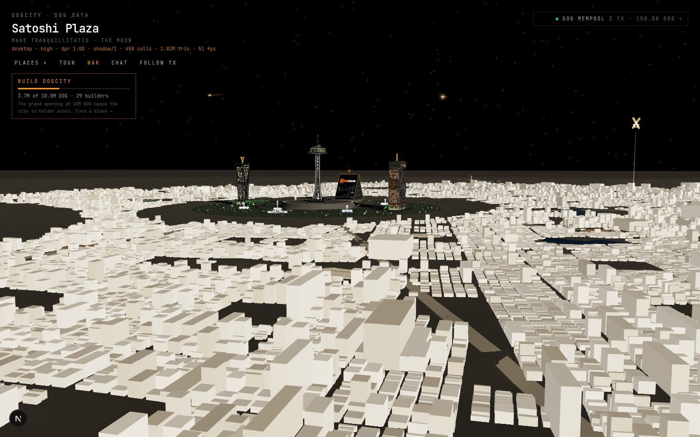

⚠️ **Isto é modelo de massa, não projeto de prédio.** Volume claro sem fachada, com
a altura vindo da tipologia que o `utxo_count` já determina: massa única, pátio,
condomínio, torre, quarteirão. É como se apresenta plano urbano ANTES de existir
arquitetura, e é o que deixa o plano ter relevo em vez de parecer planta extrudada.

O sol a 16° (`?hour=morning`) é escolha e não acaso: sombra longa é o que dá
profundidade a um modelo de massa. Ao fundo, a Praça Central e as três torres.

### A cidade dentro da abóbada

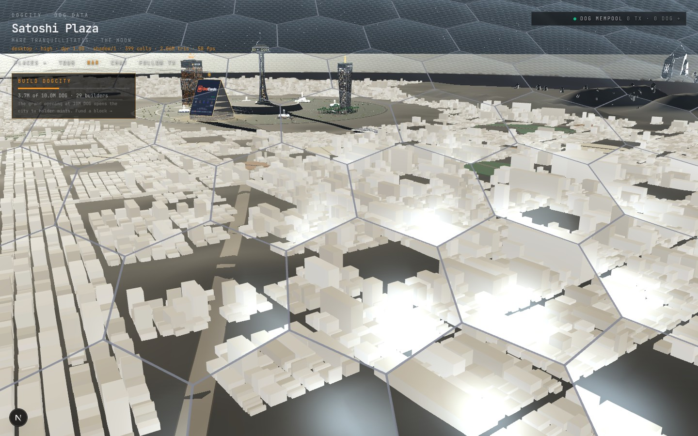

⚠️ Chapa com defeito conhecido: vista de dentro e de perto, o vidro aditivo da
colmeia lava a cidade em manchas claras e a nervura vira uma grade dura por cima do
tecido. O LOD de textura que resolveria isso está listado como não implementado em
`app/city/plaza/dome.ts`.

---

## 3.5 As vias: a rua, que até 29/08 não existia

⚠️ **O levantamento achou a razão de a chapa parecer amadora, e não era acabamento,
era ausência.** As únicas ruas com geometria eram os 12 bulevares de costura. Tudo
que se lia como rua dentro dos quarteirões era o VÃO entre os plintos, o recuo de
1,4 m de `tecido.ts`. Sem calçada, sem meio-fio, sem travessa, sem esquina. Um
loteamento sem via desenhada é uma mancha com frestas.

A rua agora é um módulo próprio, `app/city/plaza/vias.ts`, e toda a geometria sai
de `public/city/cidade-malha.json`: se o gerador mudar a malha, a rua muda junto.
Nada é desenhado à mão.

| | |
|---|---|
| quarteirões atendidos | **1.182 de 1.182** |
| bulevares | 12 |
| **via desenhada** | **1.161 km** |
| triângulos | 202.314 |
| draw calls | **4** (pista, calçada, meio-fio, canteiro) |

### As três seções

| via | largura | seção |
|---|---|---|
| contorno | 12 m | calçada 2,5 + pista 3,5, espelhado (cada quarteirão desenha 6 m) |
| travessa | 9 m | calçada 1,5 + pista 6 + calçada 1,5 |
| bulevar | 34 m | calçada 5 + pista 10 + **canteiro 4** + pista 10 + calçada 5 |

As cotas: pista +0,18, calçada +0,33, canteiro +0,40, contra o plinto de lote de
+0,45. O degrau de 15 cm entre pista e calçada é o meio-fio residencial universal
dos EUA (6 in), o único número de guia que a pesquisa achou em fonte primária, e
ele é desenhado como face vertical, não como linha.

**A pista é o valor mais escuro da cidade e a calçada o mais claro**, com o lote
entre os dois. Isso é decisão de registro e não de gosto: os maqueteiros de
masterplan (RJ Models, Artistic Models, Pipers) gravam a RUA e deixam o limite de
lote implícito. De cima a malha vira uma teia desenhada, com fio claro na borda e
miolo escuro, que é como um plano de massas se lê numa prancha.

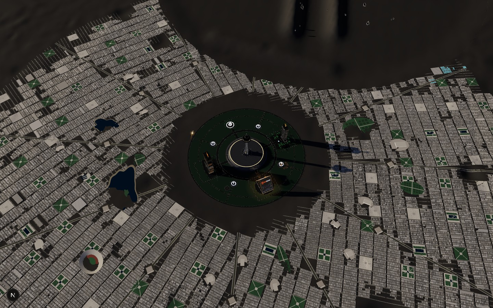

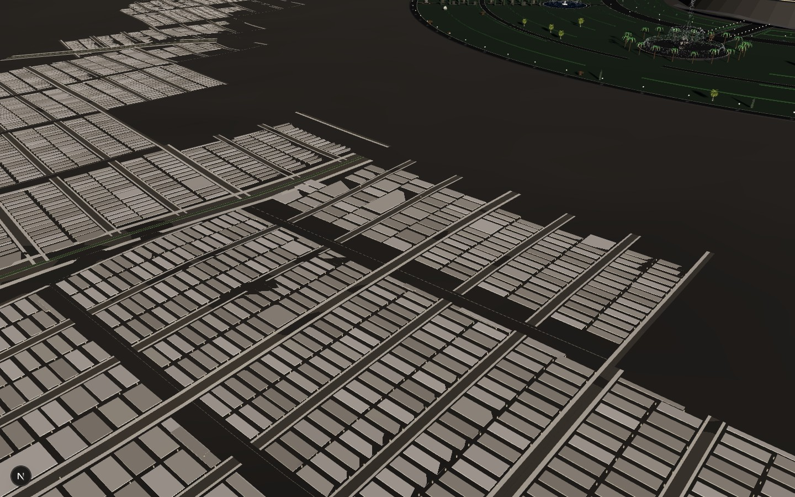

### A seção, que só aparece de perto

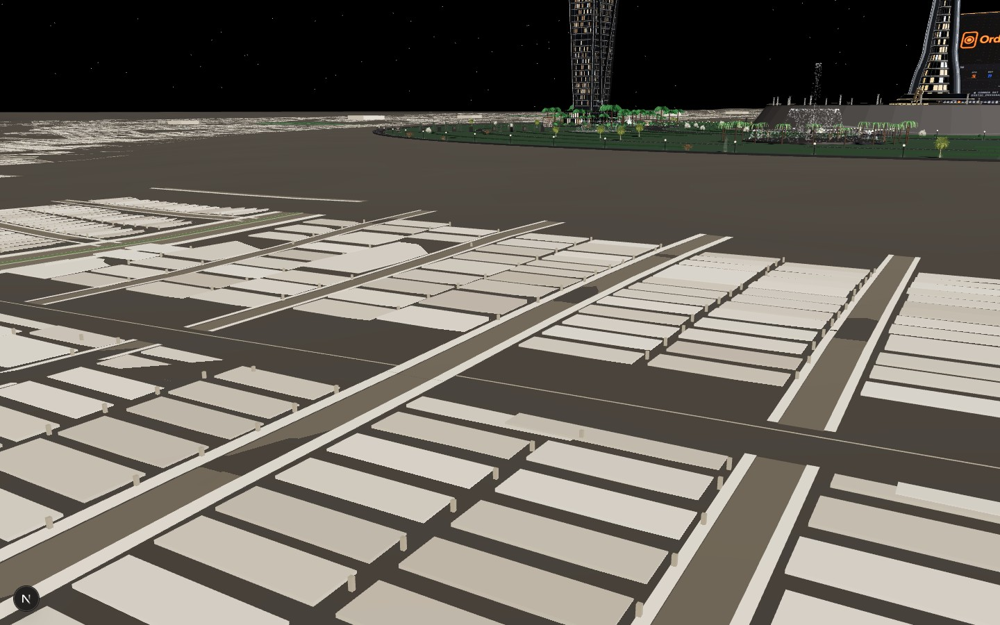

⚠️ **Acima de ~150 m a guia some e a via vira adesivo.** Por isso existe a vista
`?view=viasecao`: é a única distância em que a seção se prova. `?view=vias` é a
vista de apresentação do bairro e `?view=bulevar` é a da costura.

### O bulevar e a costura de setor

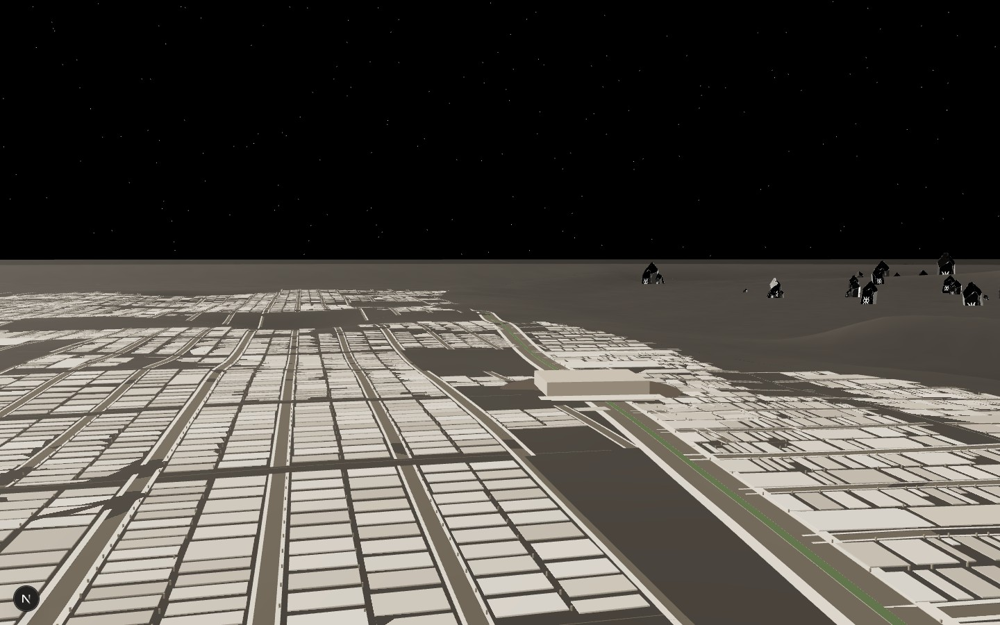

Os quarteirões giram 7,5° por setor, então na costura a grade de um setor não casa
com a do vizinho. Sem máscara, a via de contorno entraria por baixo do bulevar e
duas faixas coplanares brigariam no z-buffer. **A máscara é por SEGMENTO e não por
quarteirão**: 26 centros de quarteirão caem dentro de peça do programa e 25 desses
quarteirões têm lote, então cortar o quarteirão inteiro apagaria rua boa.

⚠️ **Os bulevares mudaram de arquivo.** Saíram de `tecido.ts` e moram em
`vias.ts`. A versão antiga desenhava a pista em +0,45 e o meio-fio em +0,30, ou
seja a seção de cabeça para baixo: a via era um planalto claro com moldura escura
em vez de uma calha. Se os dois módulos desenharem, as faixas brigam.

### Defeito conhecido da esquina

Os lados ±z do quarteirão correm 6 m a mais de cada ponta e os lados ±x param na
borda: é o que fecha a esquina sem sobrepor duas faixas. O preço é que a pista do
lado ±x termina contra a calçada do lado ±z sem face de guia nesse encontro. Some
a qualquer distância de apresentação e está escrito no código.

---

## 3.6 As praças de quarto e o chão que a câmera vê

⚠️ **Cada quarto é 3x3 células e a central nunca recebeu lote.** A célula (1,1)
não aparece na lista de quarteirões de nenhum dos 226 quartos. A documentação
registrava isso como "já era estrutura e não precisou de demarcação", e era
verdade no DADO e mentira na TELA: nada desenhava aquele chão, então de cima a
cidade tinha buracos pretos em xadrez, e depois que a rua nasceu ficou pior,
porque a malha viária passou a contornar um vazio.

`app/city/plaza/pracas.ts`, junto com `?tecido=1` (`?pracas=0` desliga).

| | |
|---|---|
| praças construídas | **128** de 226 células centrais |
| covas de árvore marcadas | **2.112** |
| triângulos | 54.634 |

**Não são as 226.** `pracaFracLivre` mede quantas das 25 sondas da célula estão
livres e no setor; 82 quartos ficam abaixo de 0,4 e quase todos são quartos de
costura com 1 a 4 quarteirões, ou seja não há tecido em volta e ali nunca houve
buraco para tapar. Meia praça numa célula bloqueada é pior que o vazio. O limiar
(0,5) é exportado de `pracas.ts` e `vias.ts` importa dele, porque a via de
contorno em volta da praça tem de concordar exatamente com quem vira praça.

**Tipologia, não 226 desenhos.** A regra da casa (cada peça com desenho próprio,
elipse não é projeto) vale para as 38 peças do programa, que são únicas e têm
nome. Praça de bairro que se repete 128 vezes é outro problema, e um masterplan
resolve com vocabulário. São quatro, e o tipo **segue o raio**: perto da Praça
Central manda o parterre formal, na periferia manda o largo verde.

| tipo | desenho |
|---|---|
| parterre | dois eixos cruzando 4 quadrantes plantados, sebe de 0,9 m, espelho no cruzamento |
| seca | piso corrido, plinto central de 1,2 m, grade 5x5 de covas com o miolo aberto |
| largo verde | gramado com duas diagonais de piso e círculo no encontro |
| água | espelho de 108 x 44 m com mureta e duas faixas de grama |

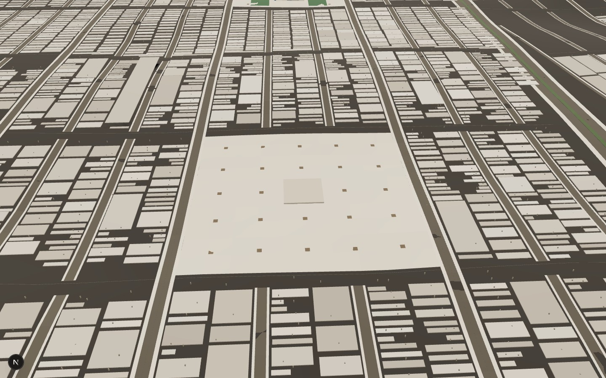


### ⚠️ O chão que a câmera vê não é `heightAt`

Este é o achado que vale para todo módulo futuro que assente coisa no chão.
`heightAt` é a superfície contínua; a MALHA do regolito é a linearização dela em
células de ~59 m, cada uma partida em dois triângulos. Entre dois vértices as
duas discordam pela flecha da corda, e quem assenta chão sobre `heightAt` fica
ora acima ora abaixo do que aparece na tela.

Medido com 4.000 sondas verticais:

| | furos antes | pior antes | furos depois | pior depois |
|---|---|---|---|---|
| pista da via | **12,7%** | −1,00 m | **0%** | +0,06 m |
| calçada | 5,5% | −0,29 m | **0%** | +0,07 m |
| piso de praça | 1,5% | −0,07 m | **0%** | +0,18 m |

O primeiro remédio (encurtar o vão da faixa de 42 para 18 m) levou a pista de
12,7% para 4,4% e nunca ia a zero, porque o resto não era erro da via: era a
malha do terreno chordando os 59 m dela. `terrain.ts` agora exporta
**`superficieAt`**, que reproduz exatamente a mesma interpolação linear da malha,
e via, praça e tecido assentam nela. Zero furo por construção.

**O lote também mudou de pé.** Ele era assentado pela altura do CENTRO, e uma
caixa é plana enquanto o terreno não é: 8,1% das sondas tinham regolito por cima
do lote, com pior caso a 11,9 m, e os piores eram os maiores (a superquadra tem
168 m de testada). Agora o pé é o MÁXIMO dos quatro cantos mais o centro: sobra
0,4% de furo (pior −1,36 m) e no outro extremo um lote grande em declive pode
boiar até 7,1 m, que é o degrau que um embasamento faz num terreno inclinado.

**Custo medido** na mesma vista, média de 3 s por rAF a DPR 1: 38,6 fps sem via e
praça, **36,5 fps com**. 476 mil triângulos e 12 draw calls a mais.

---

## 3.7 O REPLANTE de 29/08: a peça deixou de ser elipse

⚠️ **A causa raiz de "genérico e aleatório" não era acabamento, era a forma da
reserva.** Uma peça era `('E01', 'Estádio Olímpico', 'esporte', 255, 2650, 175,
130, 75)`: uma **elipse solta**, posicionada por rumo e raio, sem nenhuma relação
com a malha. A rua passava por fora dela em ângulo qualquer, não existia divisa
nem portão, e todo desenho feito dentro herdava a arbitrariedade do contorno.

Agora uma peça é `(setor, ix, iz, w, h)`: um retângulo de células de 180 m no
referencial girado do setor. De graça: toda divisa cai na via de contorno que já
existe, o portão nasce onde a rua chega, os eixos internos podem prolongar os
eixos da cidade, e a máscara vira teste de retângulo, exato.

| | antes | depois |
|---|---|---|
| peças | 38 elipses | **33 retângulos de malha + 2 elipses na casca** |
| programa | 136,0 ha | **532,5 ha** |
| anéis viários | 0 | **3, 134,8 ha** |
| tecido disponível | 25,42 km² | **22,07 km²** |
| lote mediano | 312 m² | **274 m²** |
| carteiras plantadas | 52.984 de 52.984 | **52.987 de 52.987, na 1ª passada** |

### Os três anéis, e por que eles são estruturais

Com 12 bulevares radiais e mais nada, ir do setor 4 ao setor 8 obrigava a passar
pela praça: a cidade era uma roda de bicicleta sem aro. Numa chapa isso não
aparece; numa volta de carro aparece na primeira curva.

| | largura | função |
|---|---|---|
| bulevar radial | 34 m | 12 raios, praça até o Cinturão |
| **anel** | **26 m** | 3 aros em r 1.750, 2.750 e 3.750 |
| contorno | 12 m | toda divisa de quarteirão |
| travessa | 9 m | 2 por quarteirão |

Mais **36 rotatórias** onde anel cruza bulevar. Rotatória e não cruzamento porque
numa malha radial os ângulos não são retos.

⚠️ **O anel é círculo de verdade, não polígono da malha.** Cheguei a propor que
ele seguisse a via de contorno para economizar 75 ha, com a conta da flecha de um
vão de 180 m (2,3 m a r 1.750). **A conta estava errada de escala:** uma fileira
de células é uma RETA que atravessa os 30 graus do setor inteiro, e a 30 graus ela
se afasta do círculo em 97 m, não em 2. Seguir a malha daria um dodecágono com
barriga visível.

---

## 3.8 Três defeitos que o replante desenterrou

**(1) O gerador e o 3D giravam a peça em sentidos opostos.** A convenção agora é
única e é a mesma do `giro` da malha: **MUNDO = R(rot) · LOCAL**. O gerador usava
o sinal invertido. Medido sobre `cidade-lotes.bin` antes do conserto: a máscara
guardava **0 lote** e a elipse efetivamente desenhada por `pecas.ts` caía em cima
de **174** (Lago do Poente 33, Jardim das Coortes 25, Lago Maior 23). A reserva
era honesta e o render mentia. Depois do replante: **0 e 0**.

**(2) As 34 carteiras do Dog Social Club custavam 62 m² de mediana a toda a
cidade.** Elas eram plantadas DEPOIS das 52.953 gerais, quando o setor 3 já tinha
acabado, e o laço delas descartava calado (`if r:` sem else). A bisseção via a
passada como "não cabe", baixava k, e os 52.987 lotes encolhiam juntos: a mediana
caía de **274 para 212 m²** por causa de 0,06% das carteiras. Agora o DSC planta
PRIMEIRO, que também é o que a regra 4 do fundador manda (o condomínio ocupa os
lotes mais internos ignorando a idade) e estava escrito na documentação e
desmentido pelo código.

**(3) O anel nasceu com a face virada para baixo.** Mesma armadilha de
`pracas.ts:98`: a ordem natural de escrever os cantos (raio, depois ângulo) dá
normal para baixo e o backface culling apaga tudo. Sonda vertical de 72 pontos por
anel: **8, 13 e 7 de 72** antes; **55, 63 e 71** depois (o resto são as bocas das
rotatórias, que são vazias de propósito).

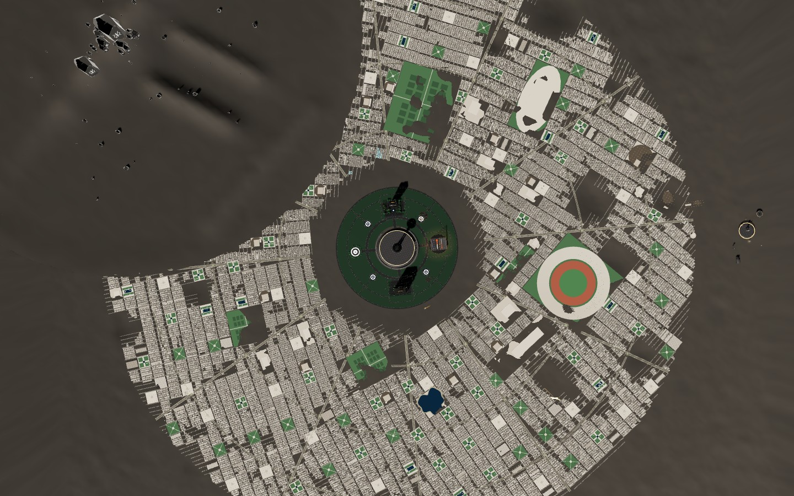

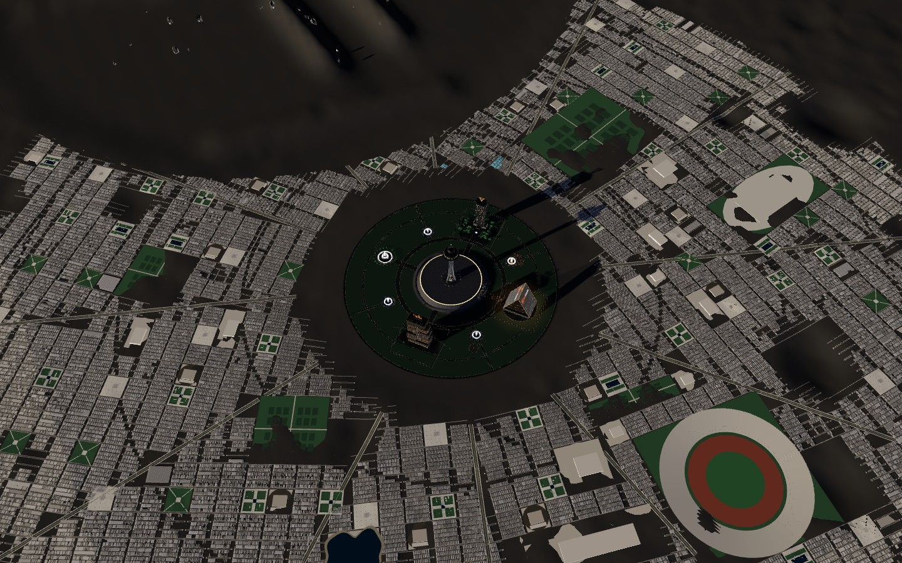

⚠️ **O que estas chapas ainda NÃO mostram:** o desenho de cada peça. A parcela
está certa e o objeto dentro dela ainda é o genérico de `pecas.ts`, que continua
sendo elipse com pista. Ou seja: **terra demarcada, obra não projetada**, e é
assim que tem de ler até cada peça ganhar módulo próprio.

---

## 3.9 As 35 peças com projeto próprio

⚠️ **A peça deixou de ser desenho genérico por tipo.** Cada uma tem módulo em
`app/city/plaza/pecas/<ID>.ts`, registrado por id do programa em `pecas/index.ts`.
Quem não estiver no registro cai no genérico de `pecas.ts`, que continua sendo
placeholder e tem de ler como tal.

**A ferramenta é o que torna isso barato.** `pecas/kit.ts` é a Prancheta: `chao`,
`anel`, `disco`, `oval`, `fita`, `vol`, `cilindro`, `arquibancada`, `pista400`,
`cova`, `alinhamento`, `moldura`. Um módulo de peça virou composição, e as
armadilhas ficam resolvidas UMA vez, dentro dela.

| | |
|---|---|
| peças com módulo | **35 de 35** |
| arquivos | 23 (as 12 Centrais dividem um módulo com variação por `c.ruido`) |
| agentes | 24 escritores + 2 de compilação, em duas levas |
| tempo | 2 min + 2 min |
| tokens de subagente | 564k + 501k |

⚠️ **`buildPecas` assenta peça numa altura só, a do centro.** Numa elipse de 175 m
passava; num Parque Olímpico de 1.080 m uma ponta enterra e a outra flutua. Por
isso módulo devolve Y de MUNDO (a Prancheta amostra o terreno ponto a ponto) e o
`buildPecas` só gira e translada no plano.

### Três defeitos do kit, e o valor dele está aqui

**(1) A componente Y de u×v é `uz·vx − ux·vz`, e eu escrevi invertido.** O efeito
foi cirurgicamente perverso: em vez de não corrigir nada, `quad()` virava
justamente as faces que já estavam CERTAS. As 12 peças da primeira leva saíram com
o chão inteiro de cabeça para baixo, e o que aparecia na cena eram só as caixas e
os cilindros, que não passam por ali.

**(2) 4 cm entre camadas basta numa praça de 168 m e não basta numa peça de
1.080.** A cruz de esplanadas do Parque Olímpico saiu rasgada em mancha e a Praça
das Medalhas em estilhaço. Agora são 12 cm.

**(3) `vol()` e `cilindro()` não recebem cota** e um agente passou `Y.L1` neles: no
`vol` virou giro de 17 graus (museu torto), no `cilindro` caiu no número de LADOS e
`CylinderGeometry` com 0,3 lado devolveu vértice NaN. Um NaN envenena o
`boundingSphere` da malha FUNDIDA, e como `buildPecas` funde todas as peças por
cor, o three reclama uma vez e não diz de quem é. Agora a Prancheta descarta a face
e **grita o id da peça**, e `cilindro` faz clamp do número de lados.

**As três foram uma correção de uma linha cada, e consertaram as 35 peças de uma
vez.** Se cada agente tivesse escrito geometria crua, seriam 35 investigações.

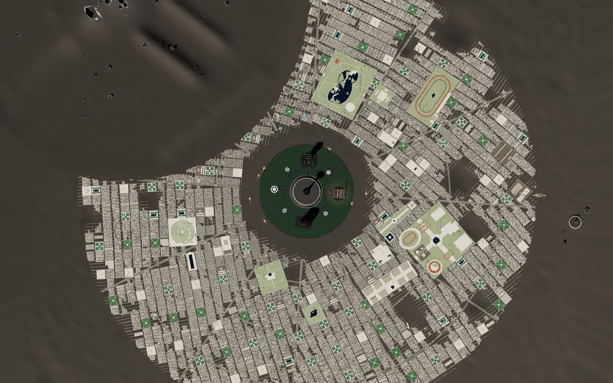

⚠️ **Isto é plano urbano bom, não é acabamento.** Os volumes ainda são caixa
branca sem fachada, a água é chapa escura sem reflexo, e não existe nada vertical e
miúdo (poste, cobertura, mastro, placar, gente). O que existe é a implantação certa
com medida certa, que é o que faz o acabamento depois não ser arbitrário.

---

## 3.10 A arborização, a borda e o Lago da Praça

### A arborização: 39.799 árvores em 4 chamadas de desenho

⚠️ **A copa não desenha por valor, desenha por SOMBRA.** Verde `#7E8A6B` contra
calçada dá 2,11:1 e contra lote 1,43:1: de cima uma copa quase some. O que
aparece numa aérea é a sombra dela, uma tracejada escura ao lado da calçada. É
por isso que a árvore pode ter 30 triângulos e ainda funcionar.

| onde | forma | espaçamento | árvores |
|---|---|---|---|
| covas de praça e de peça | esfera 30 tri | o que a peça mandou | 3.726 |
| bulevar: canteiro e 2 calçadas | cone 12 tri + esfera | 7,6 m (Portland, 25 ft) | 14.412 |
| **anéis: canteiro central** | cone | 7,6 m | **5.894** |
| via de contorno, **um lado** | esfera | 9,1 m (Portland, 30 ft) | 15.767 |

Um lado por quarteirão e não os dois: plantio unilateral em rua de 7 m é padrão
real, e os dois lados dariam mais de 35 mil só no contorno. LOD em cruz de 6
triângulos além de 400 m, **rebalanceado só quando a câmera anda 150 m**, porque
árvore não se mexe. Um material, quatro InstancedMesh, 276 mil triângulos no pior
caso.

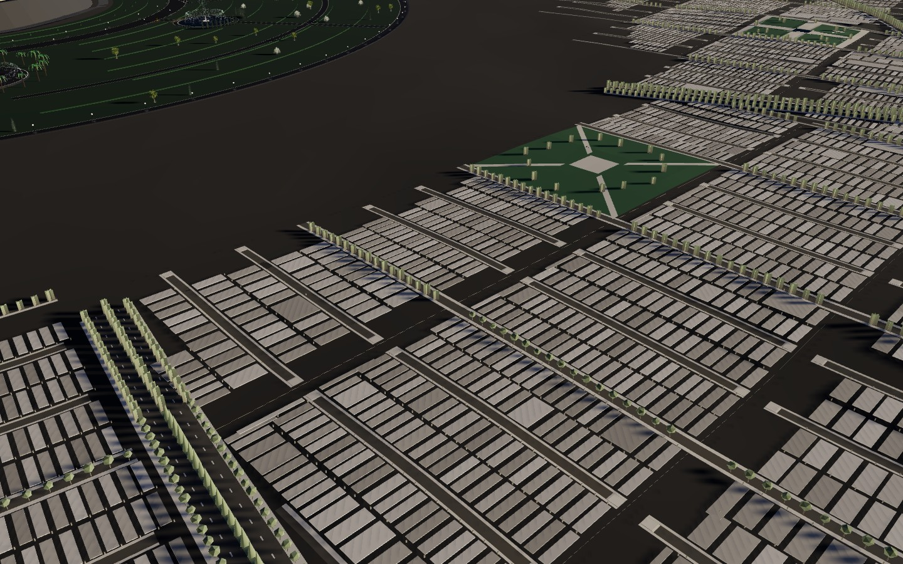

### A borda: 16 peças e a Avenida do Cinturão

⚠️ **O contorno era um círculo por construção.** `raio_borda` é 4.400 constante em
TODO rumo, e **99 quarteirões de borda têm menos de 20 lotes**: a última fileira
era meia quadra vazia, o que serrilha o perímetro. E o Cinturão tinha **279,6 ha
sem nada dentro**.

**Nada disso custou um lote**, porque tudo além de 4.400 já era proibido para
lote antes destas peças existirem. O CSV saiu igual e a mediana ficou em 274 m².

- **Avenida do Cinturão** (AN4, r 4.450, 30 m): o quarto anel, que fecha a
  cidade. Sem ela o tecido simplesmente PARA e a aérea lê corte, não fim.
- **Os 12 bulevares foram estendidos de 4.400 para 4.450** para chegarem nela.
  Sem isso a avenida seria um anel fechado ligado a nada.
- **16 peças de borda, 254 ha**: campo solar (4), reservatório (2), pátio de
  manobra (2), campo de radiadores, hortas (2), campo de treino (2), depósito
  (2), mirante. O alcance externo delas vai de 4.550 a 5.114, **desigual de
  propósito**: profundidade constante só engrossaria o mesmo círculo.

### O Lago da Praça, 4 pontes e 8 ilhas

⚠️ **Ele também não custou um lote.** O lote começa em r 1.300 e a praça acaba em
r 1.024: os 276 m entre os dois nunca tiveram endereço.

⚠️ **Mas exigiu mexer no terreno, e a medição decidiu o projeto.** Sonda de 36
rumos em r 1.300: o regolito ia de **−18,7 a +25,1 m**, ou seja 43,8 m de
amplitude só por rumo. Uma lâmina plana ali afundaria 18,7 m de um lado e boiaria
25,1 do outro. Por isso o platô foi estendido de 960 para 1.340 e a bacia foi
escavada dentro dele: fundo −26, lâmina −17, 9 m de água, talude de 70 m nas duas
margens. **209 ha de lâmina.**

As quatro pontes caem nos rumos 0, 90, 180 e 270, que são costura de setor: quem
atravessa desembarca no eixo radial que leva ao Cinturão. Tabuleiro de 26 m a
+7 m, duas torres de 74 m com tirantes.

As oito ilhas são **reserva nomeada e não construção**: disco de terra com cais e
nada em cima, igual ao resto da demarcação. A primeira é do **Dog Social Club**.

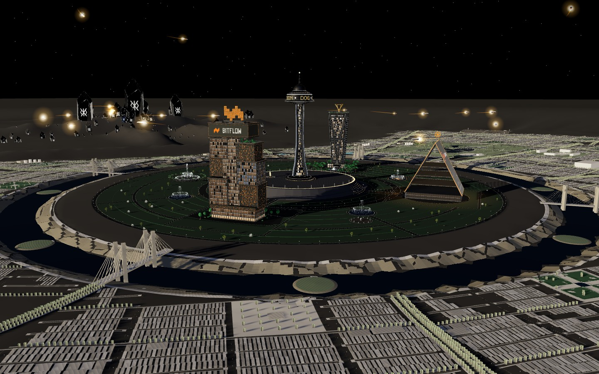

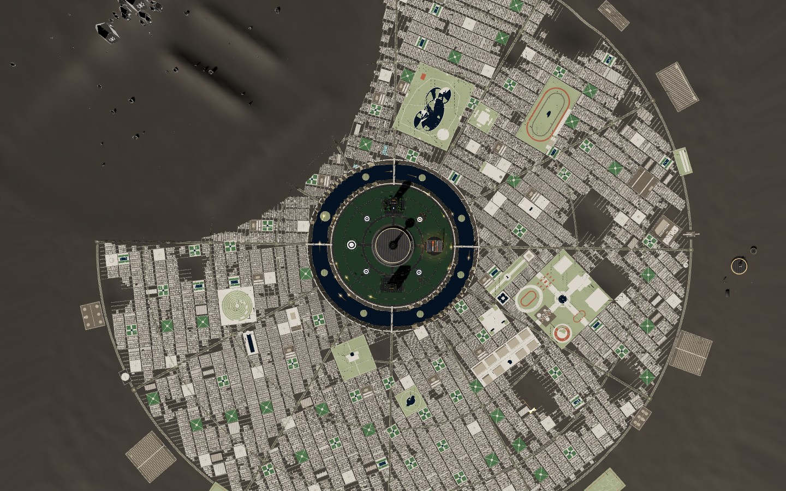

⚠️ **Duas armadilhas de margem, as duas minhas e as duas medidas.** (1) A bacia
começava em 1.020 e escavou POR BAIXO da praça, que vai até 1.024: deu um colar
serrilhado de laje plana pendurada sobre rampa. (2) Os anéis de praia usavam 180
segmentos fixos, o que dá corda de 45 m em cima de um talude de 70, e a folga de
22 cm não bastava: a margem cintilava em xadrez. Agora o passo sai do raio (18 m,
o mesmo da via e da peça) e a folga em rampa é 80 cm.

---

## 3.11 O Lago é um aquário, e a cidade recuou 150 m para ele caber

⚠️ **Decisão do fundador em 29/08: o Lago da Praça é um AQUÁRIO MARINHO.** A parte
submersa é de vidro, para o visitante ver o fundo do mar. Na Lua. Isso troca a
natureza da peça: o lago deixa de ser paisagem e vira ATRAÇÃO, que é o que a
cidade mais precisa antes do mint, porque até o mint não existe prédio para entrar.

| | |
|---|---|
| lâmina | **293 ha** (era 156) |
| largura da água | **333 m** (era 193) |
| recife | 625 peças (coral, anêmona, alga) |
| peixes | 1.120, instanciados em nuvem |
| floresta das ilhas | 896 palmeiras, samambaias, fetos e grama |
| ilhas | 8, a primeira do **Dog Social Club** |

**O REPLANTE que pagou por isso:** `R_INICIO` foi de 1.300 para **1.450 m**. O
tecido caiu de 22,07 para 21,35 km² (−3,3%) e a **mediana foi de 274 para 272 m²,
dois metros quadrados**. Eu tinha projetado 266: a bisseção achou um k melhor
(0,205 contra 0,196), porque o anel que saiu era justamente onde o gradiente faz
o lote menor. 52.984 de 52.984 plantadas.

**O vidro não é escavado no terreno, é construído dentro da água.** O talude é
rampa; encostar parede vertical nele exigiria recortar um penhasco e estragaria a
praia. A galeria fica EM PÉ no fundo, encostada na margem interna, com o teto na
cota da praça e o vidro virado para fora. É como aquário público funciona: o
visitante desce, a água não sobe. Mais um **túnel de vidro no rumo 45**, entre
duas pontes de propósito, porque quem passa sob a ponte não vê nada.

⚠️ **Uma exceção única à guarda de chão da câmera.** O laço nunca deixa a câmera
entrar no regolito, e é isso que impede o usuário de cair para dentro do planeta.
`aquario.dentro(p)` devolve true dentro da galeria e do túnel, e só ali o laço
pula o travamento: sem isso o visitante é expulso do aquário quadro a quadro.

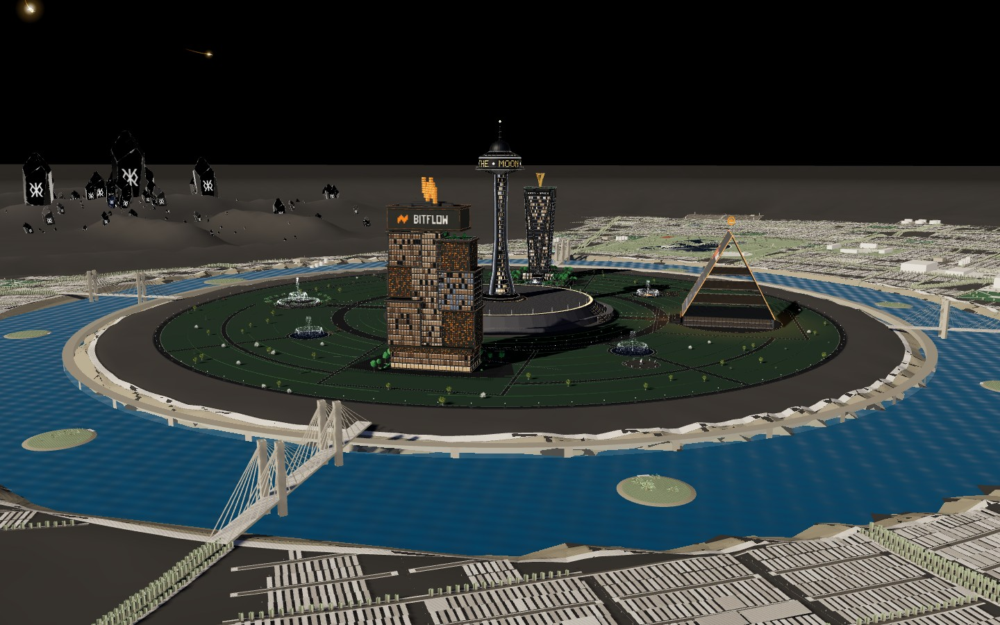

### Três erros meus, todos da mesma família

**(1) A areia do aquário tapou o lago inteiro.** Ela era UM quad radial de r 1.050
a r 1.430; nas duas pontas o chão está em 0 e no meio em −26, então o plano virou
uma TAMPA a −1,9 m sobre a água de −17. Sonda vertical: `aquario:areia @ −1,9`
acima de `lago:agua @ −17,0`, e a chapa mostrava deserto onde devia haver lago.

**(2) A praia do lago cintilava** porque os anéis usavam 180 segmentos fixos, o
que dá corda de 45 m em cima de um talude, com folga de 22 cm.

**(3) A bacia escavou por baixo da praça**, que vai até r 1.024 e não até a
muralha em 900.

**As três são a mesma coisa: superfície plana grande assentada sobre terreno que
não é plano.** O remédio é sempre o mesmo e agora está escrito nos três arquivos:
subdividir com passo de 18 m, nos DOIS eixos.

⚠️ **E o material da água não é o das peças.** `#16283C` com roughness 0,08 e
metalness 0,35 é valor de espelho de praça de 60 m: numa lâmina de 293 ha ele
devolve o hemisfério claro e lê como areia pálida. Aqui é `#24597F` com roughness
0,30 e metalness 0,02, para a cor base mandar.

---

## 3.12 A Caverna dos Runestones: reserva de volume

⚠️ **Reserva, não obra**, igual às 51 peças lá em cima. 3 câmaras no subsolo do
Parque Runestone somando **29,42 milhões de m³**: o Salão dos Runestones tem
620 x 420 m com 110 m de pé direito, maior que qualquer arena da Terra. Doze
runestones de obsidiana e duas bocas marcadas. A festa e o DJ vêm depois.

⚠️ **Ela nasceu de um defeito que continua aberto.** No Parque Runestone a câmera
entra na terra, e a causa é que o parque tem CHÃO PRÓPRIO (vale −61, cordilheira
+240 sobre o datum) enquanto a guarda do laço só conhece `terrain.heightAt`, que
ali é a cova do parque. Consertar exige o parque publicar a altura dele.

---

## 3.13 O verticalzinho, a luz e a água

### O que tira a cara de maquete é a coisa fina e alta

⚠️ Um plano de massas tem volume e chão, e por isso lê como maquete branca:
falta a **escala humana**. Um poste de 9 m ao lado de um galpão de 14 diz quanto
o galpão tem; sem ele o galpão pode ter 3 m ou 30. E numa chapa de sol a 32 graus
é a SOMBRA comprida do poste que desenha, não o poste.

`pecas/kit.ts` ganhou oito primitivas: `poste`, `postes`, `mastro`, `refletor`,
`cobertura`, `guardaCorpo`, `banco`, `placar`. **29 arquivos de peça** as
receberam, escritos por 7 agentes em paralelo com orçamento de 40 a 120 peças de
mobiliário cada.

As duas que mais mudam a leitura: o **refletor de 42 m**, que é a altura real de
torre de iluminação de estádio grande e é a silhueta que faz um campo virar
estádio numa aérea; e a **cobertura de arquibancada**, sem a qual a arquibancada
lê como degrau de concreto e com a qual a sombra do balanço desenha a bacia.

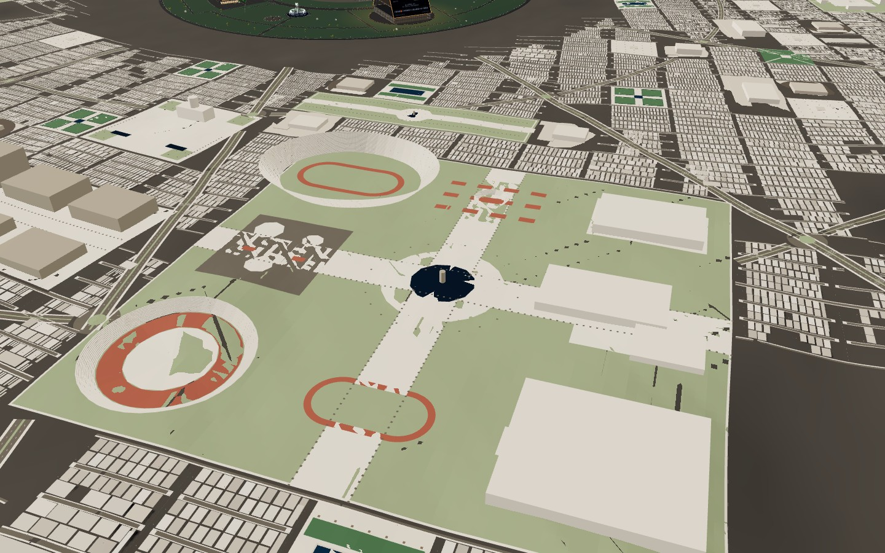

### ⚠️ Água não é uma cor, é um comportamento

Gastei três tentativas trocando o azul do lago antes de entender o erro. Um
`MeshStandardMaterial` azul liso é uma CHAPA azul: de cima ela é do tom escrito e
de raso continua do mesmo tom, o que nenhum líquido faz. O que faz o olho
reconhecer água são três coisas, e **nenhuma delas é a cor**:

1. **Fresnel.** De cima se vê o corpo d'água (escuro); de raso ela devolve o céu
   (claro). O contraste entre esses dois extremos dentro da mesma lâmina é o que
   diz "isto é líquido".
2. **Ondulação.** Três cristas cruzadas de período longo (26, 40 e 76 m) inclinam
   a normal alguns graus. Não se vê a onda; vê-se o brilho do sol se partindo
   nela.
3. **Movimento.** As cristas andam. Lâmina parada de 293 ha lê como piso polido.

Tudo em `onBeforeCompile`: **zero draw call novo, zero material novo, zero
pós-processamento.** Um Reflector de verdade redesenha a cena por espelho e está
proibido pela spec da maquete (decisão D10).

### A luz já estava resolvida, e eu é que não estava usando

O perfil `?hour=maquete` existe desde a rodada da spec: sol a 32 graus, razão sol
sobre preenchimento de 4,0:1 (a banda que a fotografia de estúdio chama de padrão
a dramático), `hemiGround` levantado de L 0,015 para L 0,043 e exposição 1,02. O
`normalBias` já tinha caído de 1,2 para 0,15, que é o que faz o volume lançar
sombra de verdade. **Eu vinha fotografando em `day` e `morning` esse tempo todo.**
As chapas desta seção são as primeiras em `maquete`.


### Custo medido

| | |
|---|---|
| fps na vista do lago | **74,1** |
| draw calls | 313 |
| triângulos | 4,79 M |
| programas compilados | **494** ⚠️ |

⚠️ **494 programas contra o teto de 235 que a spec mediu.** Não derrubou o fps
(74,1), mas é o número que mais cresceu na rodada e é o próximo a investigar: cada
programa é uma permutação de material e custa compilação e memória.

---

## 3.14 A explosão de programas de shader, e o que ela era de verdade

⚠️ **Cada mudança na CONTAGEM DE LUZES recompila todos os materiais da cena.** A
contagem entra na chave de cache de programa do three; mudou a contagem, o
renderizador recompila tudo e guarda mais uma família inteira de programas, para
sempre.

**A medição que achou o culpado:**

| | direcionais | pontuais | spots |
|---|---|---|---|
| câmera perto | 2 | **10** | **2** |
| câmera a 8,5 km | 2 | **5** | **0** |

O `DistanceCuller` escondia grupos inteiros com `visible = false`, e vários têm luz
dentro: o Parque Runestone tem 7, Monuments 2, Precinct 1, o Chalé 1, o DSC 1.
**Uma viagem de ida e volta da câmera subia os programas compilados de 444 para
480**, e navegando pela cidade isso nunca converge, porque cada combinação nova de
(pontuais, spots) é uma família nova.

### Duas tentativas que não bastaram, e por quê

**(1) Inventariar as luzes no `add()` do culling** e apagar em vez de esconder.
Estabilizou os spots e derrubou o crescimento de 36 por viagem para 9 em três,
mas seis pontuais continuavam sumindo.

**(2) Refazer o inventário na transição** de visibilidade, para pegar luz que o
módulo pendura DEPOIS de registrar o grupo. Também não bastou: aquelas seis não
estão em grupo nenhum do culling, estão penduradas em grupos e malhas que outros
módulos escondem por conta própria.

⚠️ **E não dá para consertar pelo lado da luz.** O three não conta luz cujo
ANCESTRAL está invisível: marcar a própria luz como visível não adianta, porque
quem apaga é o grupo acima dela.

### O conserto é orçamentário e não estrutural

`OrcamentoDeLuz` (perf.ts): um **lastro** de luzes de intensidade zero na raiz da
cena, ligado e desligado para completar sempre o mesmo total. O renderizador vê um
número fixo, compila uma família só, e o lastro não ilumina nada.

| | antes | depois |
|---|---|---|
| contagem perto | 2dir 10pt 2sp | **2dir 12pt 2sp** |
| contagem a 8,5 km | 2dir 5pt 0sp | **2dir 12pt 2sp** |
| programas após 4 viagens | +144 (36 por viagem) | **+2** |

O custo é honesto: o laço de 12 luzes no fragmento roda sempre, inclusive com a
cidade longe. É exatamente o que já se pagava com a câmera perto.

### O que restou, medido e sem maquiagem

Na vista do lago, carga limpa: **37,5 fps, 579 chamadas, 6,15 M triângulos**, com
o governador já em `shadowEvery 2`. Os 393 a 502 programas que sobram são
diversidade real de material dos GLBs de Sketchfab, não permutação.

Onde está o peso, e nada disso é desperdício:

| grupo | triângulos | o que é |
|---|---|---|
| batalha de preço | 1,83 M | 2.894 ursos e 2.001 dogs, já instanciados |
| tecido | 1,44 M | os 52.984 lotes e as 51 peças |
| adereços | 1,29 M | recife, peixes, floresta, árvores de GLB |
| vias | 0,45 M | 1.247 km de rua |
| Parque Runestone | 0,42 M | obsidiana, paleta própria |

---

## 3.15 Frustum não é a alavanca aqui, e a medição é que diz

O tecido era UMA InstancedMesh com os 52.984 lotes, e por isso vivia com
`frustumCulled = false`: a esfera envolvente dela tem raio de 6.894 m e cobre a
cidade inteira, então ela intersecta o frustum olhando para onde for. Fatiei em
**12 malhas, uma por setor**, cada uma com a esfera calculada a partir das
POSIÇÕES das instâncias.

⚠️ `computeBoundingSphere` não serve para InstancedMesh: ele olha só a caixa de
1 m da geometria base e devolveria uma esfera minúscula na origem, o que faria o
setor inteiro sumir da tela.

**E o resultado, medido em três vistas:**

| vista | setores no quadro | economia |
|---|---|---|
| lago | 9 de 12 | 6% |
| bairro, rasante | 10 de 12 | 3% |
| topo | 12 de 12 | 0% |

⚠️ **A razão é geométrica e vale para qualquer fatia radial: um setor é uma cunha
LONGA E FINA**, de r 1.450 a 4.400, então a esfera dela tem 1.700 m de raio e o
centro a 2.900 da origem. As doze esferas se sobrepõem no meio da cidade, e a
câmera quase sempre está no meio da cidade olhando através dela. Frustum não
descarta o que se está olhando.

A fatia fica (ela é correta e tirou uma mentira do código, o `frustumCulled =
false`), mas **a alavanca de verdade é DISTÂNCIA e não quadro**:

| | triângulos | |
|---|---|---|
| batalha de preço | **1,77 M** | 6.295 bonecos de 240 a 312 triângulos |
| o mesmo com proxy de caixa além de 700 m | **0,08 M** | 12 triângulos por boneco |

**1,69 milhão de triângulos**, que é mais que o tecido inteiro, gastos em bonecos
de 2 m vistos a 2 km. É o próximo alvo e é grande.

---

## 3.16 A cena é limitada por PIXEL, não por triângulo

⚠️ **O teste que virou a mesa.** A 720x450, com as MESMAS 571 chamadas de desenho
e os MESMOS 4 milhões de triângulos, a cena roda a **13,3 ms**. A 1440x900,
**26,7 ms**. Custo proporcional a pixel com geometria constante é assinatura de
limitação por preenchimento, e ela invalida meia dúzia de otimizações que
pareciam óbvias.

⚠️ **E cuidado com vsync ao medir.** O monitor é 75 Hz: qualquer quadro entre
13,4 e 26,6 ms aparece como 26,7. Por isso `fps` mente, e toda medição desta
seção é MEDIANA DE TEMPO DE QUADRO, não fps.

### O que foi cortado e não moveu o ponteiro

| corte | economia | efeito no quadro |
|---|---|---|
| LOD dos exércitos | 1,77 M → 62,6 k triângulos | nenhum |
| marcos de esquina com culling | 636 k triângulos + a passada de sombra | nenhum |
| tecido fatiado em 12 setores | 3 a 6% por frustum | nenhum |
| materiais Standard → Lambert em 54 malhas | shading PBR inteiro | nenhum |
| lastro de luz apagado | 12 luzes → 2 no laço do fragmento | nenhum |

**Nenhum deles é desperdício** (todos valem em máquina mais fraca, em DPR 2 e no
celular), mas nenhum era a alavanca aqui.

### A alavanca: `logarithmicDepthBuffer` desliga a rejeição precoce de pixel

O buffer logarítmico escreve `gl_FragDepth` no FRAGMENTO. Isso obriga o GPU a
rodar o shader inteiro antes do teste de profundidade, ou seja **mata o early-Z**.

E esta cena empilha camada de chão como ninguém: terreno, pista, calçada, praça,
plinto de lote, parcela de peça, moldura, e sobre o lago ainda areia e água. São
**4 a 6 camadas sobrepostas por pixel**, e sem early-Z todas elas são sombreadas.

| | mediana de quadro | fps |
|---|---|---|
| com `logarithmicDepthBuffer` | 26,7 ms | 37,5 |
| **sem** (`?logdepth=0`) | **21,3 ms** | **46,9** |

**20% do quadro**, e o suficiente para sair do travamento de meia taxa do vsync.

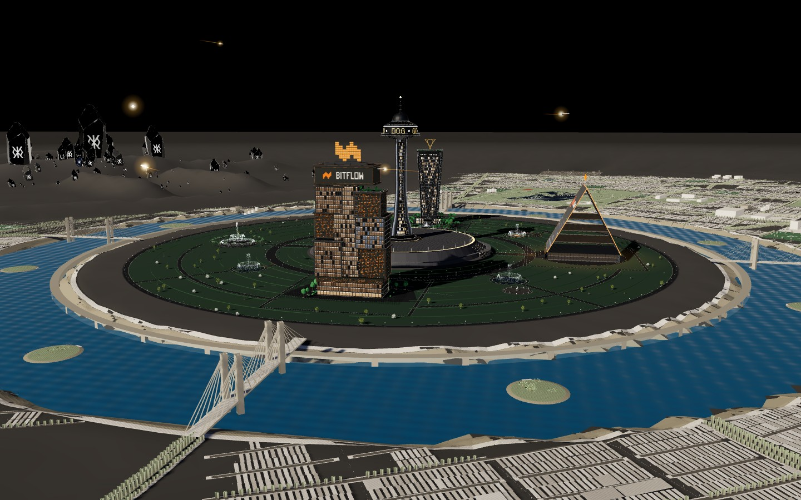

⚠️ **NÃO É UM FLAG PARA VIRAR E ESQUECER.** O buffer logarítmico está lá porque a
cena tem 12 km de profundidade e um plano near pequeno; tirar exige recalibrar
near e far e conferir briga de profundidade em TODAS as vistas, inclusive a do
Cinturão (r 4.500), a do Parque (5,2 km) e a de dentro do túnel do aquário. Na
vista do lago não há briga nenhuma, mas uma vista não é prova.

Fica atrás de `?logdepth=0` até essa conferência existir.

---

## 4. A demarcação: 38 peças, 136 ha

Reservadas **antes** do lote, cumprindo `masterplan.md:268-269` pela primeira vez.
O gerador se recusa a gravar se algum lote cair dentro de peça, e a conferência
está em `scripts/gerar_cidade.py`.

| tipo | peças | ha |
|---|---|---|
| distribuição | 15 | 33,5 |
| jardim e parque | 4 | 31,7 |
| água | 2 | 28,5 |
| cívico | 12 | 25,8 |
| esporte | 5 | 16,4 |

**A cadeia de distribuição das moedas** é o caminho de uma transação pagando um
endereço, posto no chão: a nave pousa fora, no Spaceport em r 5.150; a moeda entra
pelo **Portão da Abóbada** (rumo 177°, r 4.450); é triada na **Alfândega**; passa
pelo **Pátio de Contêineres**; e desce pelos bulevares até as **12 Centrais de
Distribuição**, uma por setor, em r 2.200.

**Esporte** tem Estádio Olímpico com pista de 400 m, Estádio de Futebol, ginásio
coberto, complexo aquático e skatepark. **Água** tem Lago Maior (680 × 400 m) e Lago
do Poente. **Jardim** tem Botânico, Parque Central, Jardim das Coortes e Alameda dos
Fundadores.

Já eram estrutura e não precisaram de demarcação: as 226 praças de quarto (cerca de
3,6 km²), os 12 bulevares, o precinto da praça, o Parque Runestone e o Coliseu
congelado.

---

## 5. A abóbada e a estação

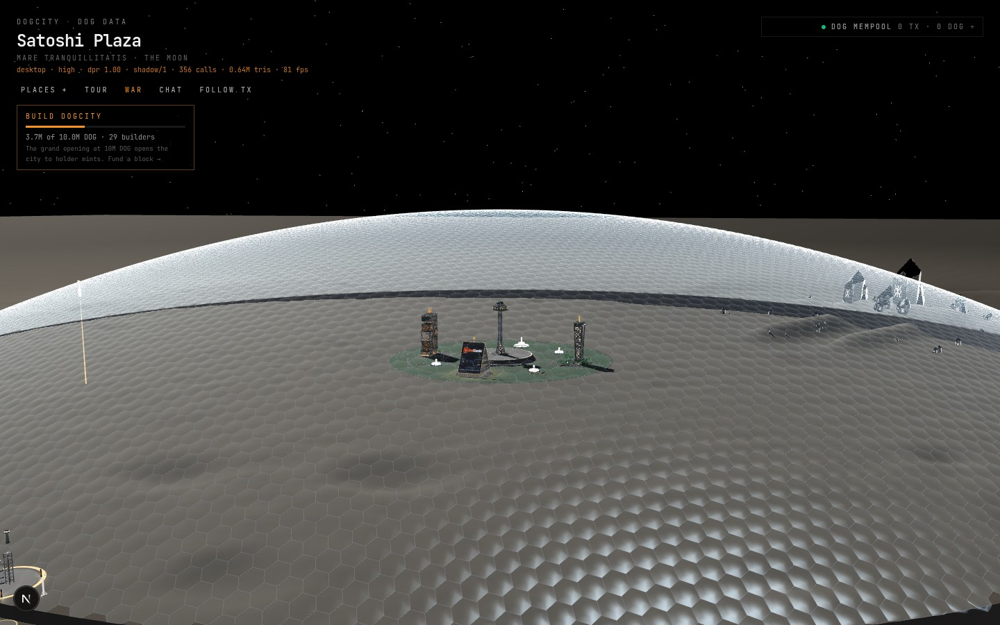

Colmeia de célula 42 m cobrindo o sítio inteiro: 13.885 células, 334.818 triângulos.
A cidade é pressurizada.

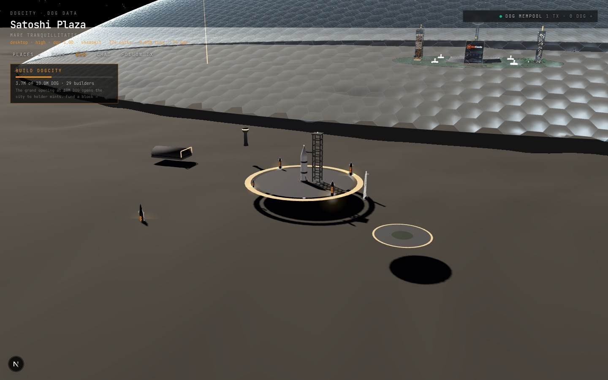

Foguete não atravessa a abóbada, então a estação foi para **raio 5.150**, com 350 m
de chão livre além da saia. E a órbita das naves subiu 1.020 m para passar por cima
da coroa.

---

## 6. O registro: quem é dono de qual lote

`data/dogcity_lotes.csv`, 52.991 linhas. Uma por carteira, com `lot_id`, endereço,
ordem de chegada, setor, quarto, quarteirão, número, posição, raio, frente,
profundidade, área, saldo, `utxo_count`, forma, coorte, família e a marca do DSC.

O formato do endereço é `S{setor}-Q{quarto}-B{quarteirão}-L{lote}`. A carteira mais
antiga da cidade:

```
lot_id   S04-Q01-B001-L001
raio     1.338 m   (o mais perto da praça que existe)
área     1.392 m²  ·  37,4M DOG  ·  1 UTXO  ·  massa única  ·  coorte 0
```

⚠️ **A ordem das linhas do CSV é a ordem dos registros do `.bin`, uma para uma.** A
prancha e a cena desenham pelo índice e o registro dá o nome. Quebrar essa
correspondência desalinha o mapa inteiro em silêncio.

---

## 7. O que foi conferido, e com que resultado

| conferência | resultado |
|---|---|
| carteiras sem lote | **0** |
| endereços duplicados | **0** |
| `lot_id` duplicados | **0** |
| lotes dentro do Coliseu congelado | **0** |
| lotes dentro do Parque Runestone | **0** |
| lotes fora do sítio | **0** |
| lotes dentro de peça demarcada | **0** |
| CSV alinhado com o `.bin` | **sim, registro a registro** |
| R² de coorte contra raio | **0,6135** (era 0,8004 com o contorno lobado) |
| sobreposição entre coortes vizinhas | 76,1% |
| regra "mais antigo, mais perto da praça" | **10 dos 12 setores monótonos** |

---

## 8. Defeitos conhecidos, sem maquiagem

**O setor 2 tem uma inversão de 35 m** entre as coortes 3 e 4 (1.533 contra 1.498
de raio médio). Ele é o setor que o Parque Runestone esmaga, com 15,8 ha contra os
250 a 290 dos outros; com tão pouca terra, a janela de busca do empacotador às vezes
põe um lote mais novo numa prateleira mais interna. É defeito, não decisão.

**O setor 3 quebra a monotonia de propósito.** É o condomínio do Dog Social Club
ocupando os lotes mais internos ignorando a idade, que é a regra 4 do fundador.

**455 lotes (0,86%) têm o setor gravado diferente do rumo geométrico.** São lotes
cuja borda cruza a costura entre setores. Vieram de 49.021 (92,5%) antes do conserto
da rotação dupla em 28/08.

**O aproveitamento do tecido é 83%.** O resto se perde em ponta de prateleira e na
frente mínima de 5 m. Já foi 71,8%.

**O contorno voltou a ser um disco.** As cinco pétalas foram testadas e reprovadas:
compravam 0,047 de R² e cobravam 6,46 km² de lote e 91 m² na mediana. A modulação de
cinco sobrevive como **ritmo no cotista**, não como recorte no contorno.

---

**Superquadra sobrepondo lotes normais: CONSERTADO em 29/08.** O ramo gigante de
`coloca()` tomava 6 prateleiras a partir da ESCOLHIDA, que pode ser a fileira 3 de um
quarteirão: consumia as fileiras 3..5 deste e 0..2 do seguinte, mas gravava o lote
centrado no quarteirão da escolhida, em cima de lotes já plantados. Medido antes:
7 de 24 superquadras cobriam 141 lotes. Agora a superquadra varre para a frente até
achar um quarteirão cujas seis fileiras ainda estejam intactas e toma o quarteirão
inteiro. Medido depois: **26 superquadras, 0 sobreposições, 0 lotes cobertos, e
nenhuma delas divide quarteirão com outro lote.** O lote mediano subiu de 287 para
312 m² no mesmo movimento, porque a área que se perdia na sobreposição voltou.

---

## 9. O que ainda não existe

O 3D dos prédios. A forma por `utxo_count` está gravada em 3 bits e nada a
renderiza: massa única, pátio, condomínio, torre e quarteirão existem no dado e não
na tela.

A regra publicada. Enquanto a alocação não for pública com a tupla de desempate, a
curva, as cotas e a lista das 38 peças, mudar qualquer coisa ainda é barato. Depois
vira acusação de favorecimento.

**As 98 células centrais que continuam vazias.** Das 226, 128 viraram praça
(§3.6). As outras estão abaixo do limiar de célula livre e quase todas são quartos
de costura com 1 a 4 quarteirões: não há tecido em volta delas, então não leem
como buraco. Se um dia o gerador encher esses quartos, elas voltam à fila.

**O fundo de quarteirão continua nu.** O aproveitamento é 83%; os 17% que sobram
não estão espalhados, estão concentrados em faixas atrás das fileiras rasas, e com
a rua desenhada em volta essas faixas leem como terreno baldio dentro da quadra.
Não é defeito de dado (lote raso é lote pequeno, e lote pequeno é carteira
pequena), é assunto de desenho: o que ocupa o miolo do quarteirão.

**A arborização.** Oito espécies já estão convertidas e instanciadas em
`props.ts`, e o canteiro central do bulevar existe justamente para recebê-las.
Nenhuma árvore foi plantada em via até agora.
